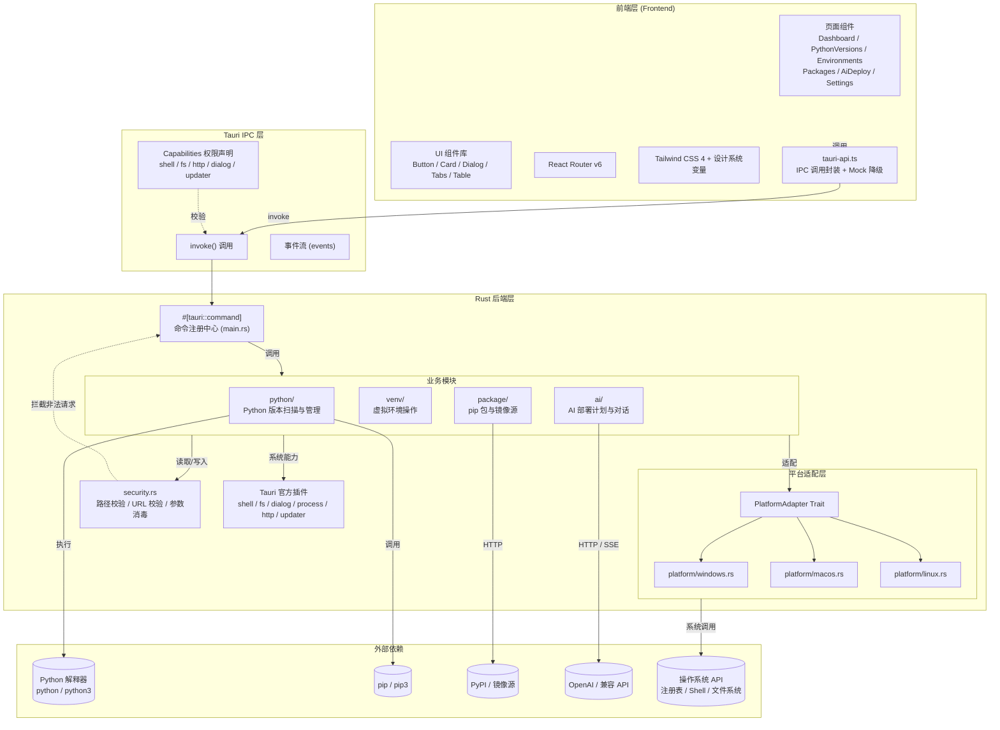
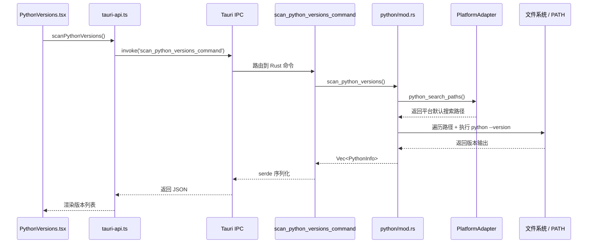
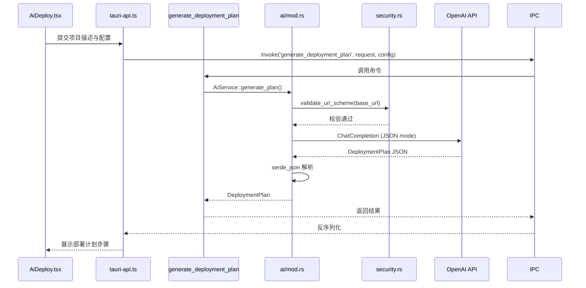
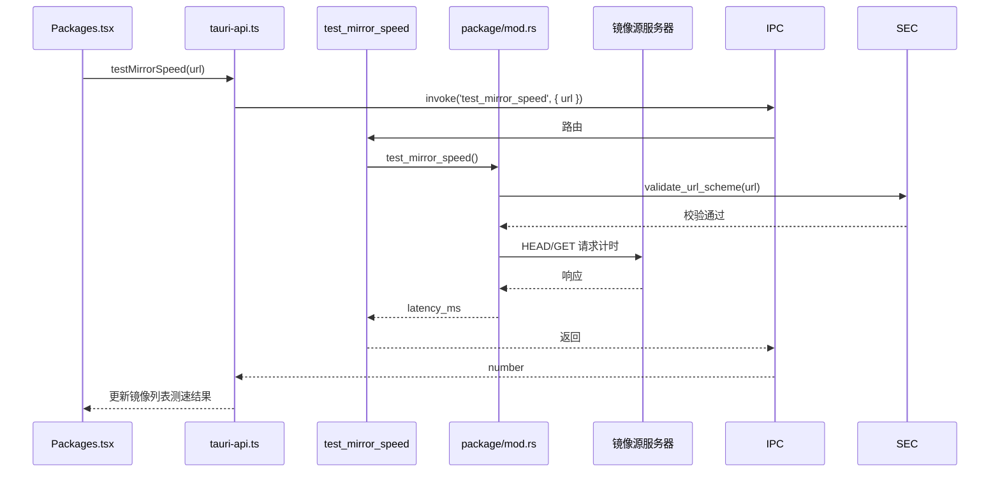

# PyForge AI 架构设计

本文档从高层视角描述 PyForge AI 的整体架构、核心模块职责与数据流向，帮助开发者快速理解系统组成。

---

## 目录

1. [设计目标](#设计目标)
2. [高层架构图](#高层架构图)
3. [模块说明](#模块说明)
4. [请求处理流程](#请求处理流程)
5. [数据流示例](#数据流示例)
6. [安全边界](#安全边界)

---

## 设计目标

- **跨平台一致性**：同一份 Rust + React 代码库覆盖 Windows、macOS、Linux。
- **性能优先**：Rust 后端负责系统级操作，前端仅做展示与交互，避免阻塞主线程。
- **最小权限**：前端无法直接访问文件、进程或网络，所有敏感操作通过 Tauri IPC 与声明式 Capabilities 控制。
- **可扩展性**：平台适配器、Python 引擎、AI 服务均以接口/模块化方式组织，便于替换或增强。

---

## 高层架构图

---

## 模块说明

### 1. 前端层（Frontend）

| 目录/文件 | 职责 |
| --- | --- |
| `src/App.tsx` | 应用根组件，定义路由与布局壳。 |
| `src/pages/*` | 六大核心业务页面。 |
| `src/components/ui/*` | 通用 UI 组件，保持与设计系统一致。 |
| `src/components/layout/*` | 应用级布局组件（侧边栏、顶栏、外壳）。 |
| `src/lib/tauri-api.ts` | 统一封装 Tauri `invoke` 调用，提供 mock 数据降级，保证浏览器中可独立预览。 |
| `src/types/*` | TypeScript 类型定义，与后端数据结构对齐。 |

前端不负责任何系统级决策，所有状态变更通过 `tauri-api.ts` 提交到 Rust 后端。

### 2. Tauri IPC 层

| 概念 | 说明 |
| --- | --- |
| `invoke()` | 前端调用 Rust 命令的唯一通道。 |
| `events` | 后端向前端推送异步事件（如流式 AI 输出、进度通知）。 |
| `capabilities/default.json` | 声明式权限清单，控制前端可调用的命令与资源范围。 |

### 3. Rust 后端层

#### 3.1 命令中心：`src-tauri/src/main.rs`

- 初始化 Tauri Builder、管理全局 `PlatformAdapter` 状态。
- 注册所有 `#[tauri::command]` 命令。
- 加载 `tauri-plugin-shell`、`tauri-plugin-fs`、`tauri-plugin-dialog`、`tauri-plugin-process`、`tauri-plugin-http`、`tauri-plugin-updater` 等官方插件。

#### 3.2 业务模块

| 模块 | 文件 | 职责 |
| --- | --- | --- |
| Python 引擎 | `src-tauri/src/python/mod.rs` | 扫描本地 Python 安装、解析版本、获取 pip 与架构信息、设置默认 Python。 |
| 虚拟环境引擎 | `src-tauri/src/venv/mod.rs` | 创建、删除、列出虚拟环境，解析依赖树。 |
| 包管理引擎 | `src-tauri/src/package/mod.rs` | 镜像源管理、包搜索、已安装包列表、测速。 |
| AI 引擎 | `src-tauri/src/ai/mod.rs` | 通过 `async-openai` 调用大模型，生成部署计划、分析依赖冲突、完成对话。 |

#### 3.3 平台适配层

| 文件 | 说明 |
| --- | --- |
| `src-tauri/src/platform/mod.rs` | 定义 `PlatformAdapter` Trait 与公共类型（`OsType`、`PackageManager`、`Shell`、`PlatformInfo`）。 |
| `src-tauri/src/platform/windows.rs` | Windows 平台实现：注册表 PATH 操作、PowerShell Profile、Python 默认搜索路径。 |
| `src-tauri/src/platform/macos.rs` | macOS 平台实现：Homebrew 检测、zsh/bash Profile、Unix 权限。 |
| `src-tauri/src/platform/linux.rs` | Linux 平台实现：apt/dnf/pacman 检测、Shell 配置、alternatives 系统。 |

运行时通过 `#[cfg(target_os = "...")]` 条件编译选择对应适配器，编译产物只包含当前平台代码。

#### 3.4 安全模块

`src-tauri/src/security.rs` 提供：

- `validate_path()`：防止目录穿越与越界访问。
- `validate_url_scheme()`：限制允许的 URL Scheme（`http` / `https`）。
- `sanitize_command_args()`：对子进程参数进行消毒。

### 4. 外部依赖

| 外部实体 | 交互方式 |
| --- | --- |
| Python 解释器 | 通过 `tauri-plugin-shell` 执行 `python -m venv`、`python --version` 等命令。 |
| pip | 通过 Python 子进程调用 `python -m pip ...`。 |
| PyPI / 镜像源 | 后端 `reqwest` 发起 HTTPS 请求获取包元数据。 |
| OpenAI / 兼容 API | 后端 `async-openai` 发起 Chat Completion 请求，流式响应通过事件通道推送到前端。 |
| 操作系统 | 平台适配器调用注册表、Shell 配置、文件系统等 API。 |

---

## 请求处理流程

以「扫描本地 Python 版本」为例：

---

## 数据流示例

### AI 智能部署

### 镜像源测速

---

## 安全边界

| 边界 | 控制措施 |
| --- | --- |
| 前端 ↔ 后端 | 所有调用经过 `invoke()`，受 `capabilities/default.json` 权限约束。 |
| 后端 ↔ 文件系统 | 通过 `tauri-plugin-fs` 与自定义 `security::validate_path` 双重校验，限制可访问路径。 |
| 后端 ↔ 子进程 | `shell:allow-execute` 白名单仅允许 `python`、`python3`、`pip`、`pip3`。 |
| 后端 ↔ 网络 | `http:default` 白名单仅允许 `pypi.org`、`*pypi.org` 与 `api.openai.com`；CSP 同步声明。 |
| 后端内部 | Rust 所有权系统、错误处理与输入校验防止内存与逻辑漏洞。 |
| 分发 | 代码签名（Windows/macOS/Linux）+ 自动更新签名验证，防止篡改。 |

---

## 演进方向

1. **本地 LLM 支持**：在 `ai/` 模块中引入 `candle` 或兼容的本地推理后端，降低对外部 API 的依赖。
2. **uv 集成**：将 [uv](https://github.com/astral-sh/uv) 作为可选 Python 引擎，通过子进程或 Rust FFI 调用，提升包管理性能。
3. **插件化平台扩展**：未来可将平台适配器拆分为独立 crate，便于第三方扩展。
4. **流式事件**：AI 对话与长耗时操作（如批量安装）通过 Tauri 事件通道实现实时进度推送。
